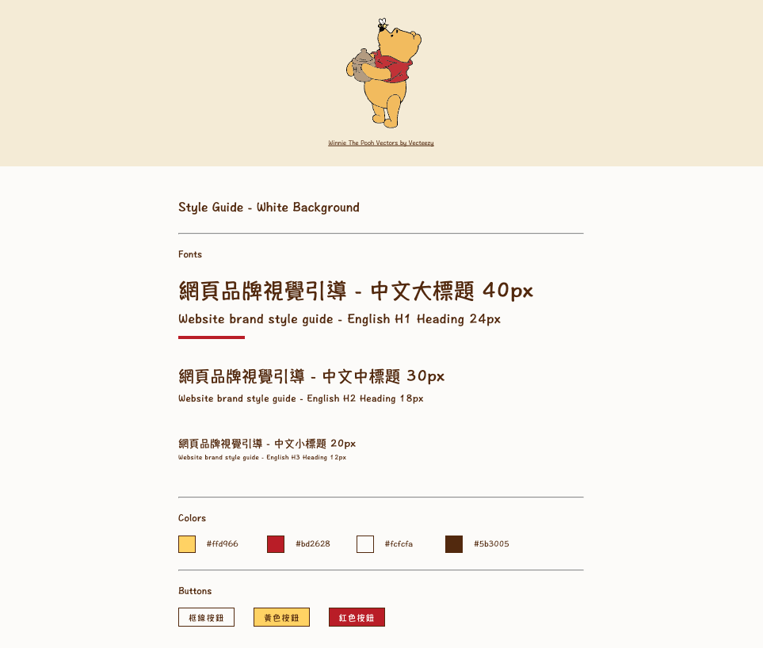
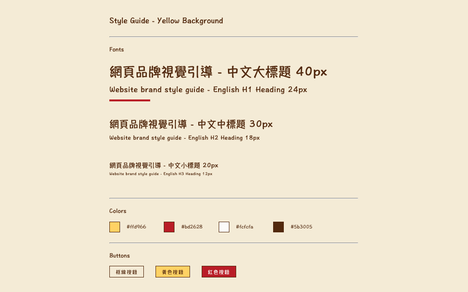
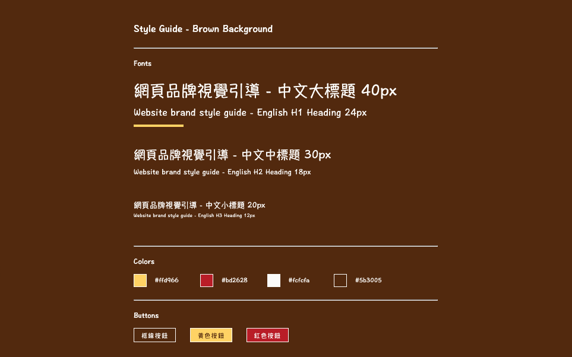

# **Project 2. Style Guide**

## **Overview**
This project is a front-end style guide inspired by "Winnie the Pooh"-themed colors. It is built using **Pug** (HTML preprocessor) and **Sass** (CSS preprocessor) to demonstrate clean and reusable code practices.

**Live Demo:** [View on CodePen](https://codepen.io/WinnyChang-Yun/pen/gbYeKjb)

## **Tech Stack**
- **Pug**: Structured the HTML efficiently with a clean and readable syntax.
- **Sass**: Styled the layout, typography, and design elements using variables, mixins, and nesting for maintainability.

## **Features**
- A modular style guide with sections for:
  - Typography (Chinese and English headings with various font sizes).
  - Color palette with hex codes.
  - Button designs in multiple styles (bordered, yellow, red).
- Three background themes: white, light yellow, and brown.
- Text and background colors meet WCAG 2.0 Level AA contrast standards for accessibility.
- Reusable and scalable code using Sass variables and mixins.

## **Lessons Learned**
- Simplified HTML structure using Pug for improved readability.
- Leveraged Sass features like variables (`$color_yellow`, `$font_base_size`) and mixins (`@mixin size`) to create reusable styles.
- Implemented responsive design techniques to ensure:
  - The main content remains centered on wider screens.
  - Colors and buttons stack neatly with proper margins on narrower screens.

## **Future Improvements**
- Add interactivity using JavaScript (e.g., hover effects on buttons).
- Further enhance accessibility by adding ARIA labels and ensuring all elements meet WCAG 2.0 Level AAA contrast standards.

## **Author**
**Winny Chang**
